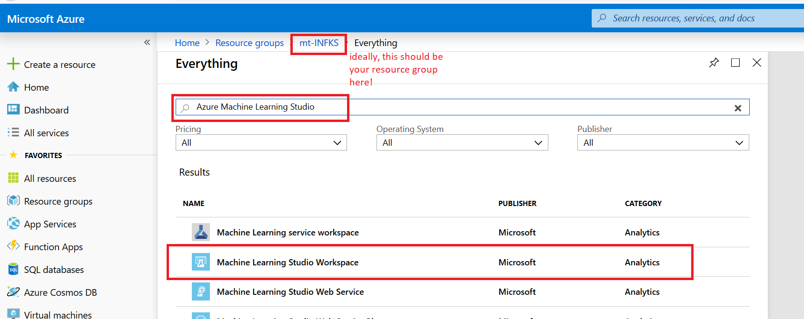
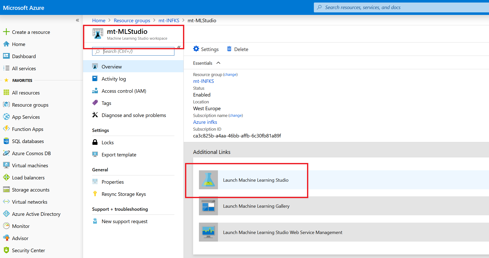

# Übung - 01: Clustering and Classification

## Ziel der Übung

Es ist Zeit mal selber tätig zu werden und versuchen das Gelernte einmal praktisch zu probieren.

---

## Titanic Survival

**Today, we’re going to create a model to predict who would have lived (and died) during the sinking of the titanic!**

## Get the Data

Die Daten für die Uebung liegen im [Moodle Kurs](https://learning-campus.th-rosenheim.de/mod/folder/view.php?id=49481). Der Datensatz heisst _Titanic DataSet_ und umfasst 3 Dateien.

Diese am besten herunterladen und irgendwo auf dem Rechner ablegen!

## Aufgabe: Baue einen Classifier mit Azure ML Studio

Was ist zu tun?

- In der Ressourcegruppe auf [Azure](https://portal.azurer.com) erstelle **Machine Learning Studio Workspace**

- Waehle den angelageten Workspace aus und **Launch Machine Learning Studio**

- Im ML Studio mache folgendes:

1. Erstelle ein neues **Experiment**
2. Lade die Titanic-Daten von der lokalen Platte
3. Filter die Spalten
4. Definiere Metadaten
5. Waehle 2 Classifier aus, die du vergleichst
6. Schaue dir das Ergebnis an

Im Falle, dass es Fragen bei den einzelnen Schritten gibt, gibt es am Ende ein **How-To**

**NOTE**
Ein paar informationen zu den Daten:

- _survival_ Survival (0 = No, 1 = Yes)
- _pclass_ Ticket (class 1 = 1st, 2 = 2nd, 3 = 3rd)
- _sex_ Sex 
- _Age_ Age in years
- _sibsp_ # of siblings / spouses aboard the Titanic
- _parch_ # of parents / children aboard the Titanic
- _ticket_ Ticket number
- _fare_ Passenger fare
- _cabin_ Cabin number
- _embarked_ Port of Embarkation (C = Cherbourg, Q = Queenstown, S = Southampton)

## Aufgabe: Versuche mittels Jupyter Notebook und k-means die Titanic Daten zu clustern

1. Gehe auf dein [Azure Notebook](https://notebooks.azure.com)
2. Melden sie sich an und laden sie ueber **Upload** das [k-mean-titanic.ipynb](k-means-titanic.ipynb) in den Notebook-Workspace.
3. Dort kann durch Auswaehlen das Notebook gestartet werden.

**Ziel** ist es mit der K-Means Klasse ein wenig Erfahrung zu sammeln und zu schauen, ob sich ein Cluster erstellen laesst und wo man persoenlich in dem Cluster liegt.

## How-To zu Azure Machine Learning Studio

Import Data set

    Click DATASETS
    Click NEW
    Click FROM LOCAL FILE

Upload a new dataset

    Click Choose File
    Brows and select train.csv
    ENTER A NAME FOR THE NEW DATASET TitanicTrain1
    SELECT A TYPE FOR THE NEW DATASET Generic CSV File with a header (.csv)
    PROVIDE AN OPTIONAL DESCRIPTION kaggle Titanic: Machine Leering from disaster

    Click

Verify dataset uploaded

    Click DATASETS
    Make sure TitanicTrain1 is in MY DATASETS list

Create New Experiment
Create Blank Experiment

Set experiment name
    Type in name = Titanic 1

Drag & drop dataset to canvas

    Click Saved Datasets / My Datasets
    Drag & drop TitanicTrain1 to canvas

    Visualize output   Drop the columns PassengerID, Name, Ticket, Cabin

    Drag & drop module Select Columns in Dataset
    Selected columne = Drop Columns: PassengerId, Name, Cabin, Ticket
    Click Launch column selector
    Visualize

Drop the columns PassengerID, Name, Ticket, Cabin

    Begin With = ALL COLUMNS / Exclude / column name
    Selected column PassengerID, Name, Ticket, Cabin
    Click
    Visualize

Make categorical values: Survived, Pclass, Sex, Embarked

    Drag & drop Edit Metadata
    Comment = Cast and Rename Columns: Survived, PClass, Sex, Embarked
    Selected column Survived, Pclass, Sex, Embarked
    Data type = Unchanged
    Categorical = Make categorical
    Fields = Unchanged
    New column name = Survived, PassengerClass, Gender, PortEmbarkation
    Visualize

Rename columns

    Drag & drop Edit Metadata
    Comment = Rename Columns: SiblingSpouse, ParentChild, FarePrice
    Selected column SibSp, Parch, Fare
    Data type = Unchanged
    Categorical = Unchanged
    Fields = Unchanged
    New column name = SiblingSpouse, ParentChild, FarePrice

    Visualize  
    Replace missing value with median

    Drag & drop Missing Values Scrubber
    Comment = Replace missing value with median
    Set properties
    Visualize

Drop rows with missing data

    Drag & drop Missing Values Scrubber
    Comment = Drop rows with missing values
    Set properties
    Visualize

Create Label

    Drag & drop Edit Metadata
    Comment = Assigning target variable
    Selected column = Survived
    Data type = Unchanged
    Categorical = Unchanged
    Fields = Label
    New column name = -
    Visualize

Import and Dataset preparation
Split data 70% training and 30% scoring

    Drag & drop Split data
    Set properties

Add Algorithm, Train and Score

    Add Two-Class Boosted Decision tree
    Add Train Model
    Add Score Model

Add Two-Class Boosted Decision tree

    Drag & drop Two-Class Boosted Decision tree
    Set properties

Add Train Model

    Drag & drop train model
    Set column to Survived

Add Score Mode

    Drag & drop Score Model
    Set property = Append score column
    Save
    Run experiment
    Visualize
